# MAD2023_Team2
MAD Assignment Draft for App

Team Members:
Marcus Vincent Siah-s10220964
Lee Guan Xi-s10244223
Rachelle Lim Si Tong-s10243170
Javier Toh Seng Hong-s10243660
Thant Thu Ta-s10242515

# EfficienZ

## Brief introduction to the app

## EfficienZ is a productivity app which aims to help individuals optimize their time by being more organized and staying on track with their tasks to complete their goals efficiently. With a range of features, EfficienZ aims to enhance productivity and overall work-life balance. Features like task management and time tracking can help organize tasks and work better. 

## App category: Productivity

Stage 1 Features
1.	Managing Tasks (Marcus) – Create and organize tasks easily. Users will be able to set due dates and due time. Tasks will be stored from what is due first to last. Users can also update/edit current tasks if they want to make changes.  Users can also click on the checkbox when they are done. Users will also be able to delete the tasks once done.

2.	Time tracking (Thu Ta) – Users can set a time limit for specific tasks. They can pause and reset the time as well. The timer will keep running in the background once started and users and only do one task at a time. This allows the user to stay focused on a task and manage their time better

3.	Progress bar(Rachelle) – On the home page there will be a progress bar to show users how many tasks have been completed in the week. For example if there are 8 tasks due this week and 4 has been completed, the progress bar will be filled halfway. This helps users keep track of their progress throughout the week

4.	Music(Javier) – There collection of ambient sounds and music to improve concentration/focus. Users can choose music like nature, instrumental music, lofi, etc. which also helps reduce distractions 

5.	Note-taking (GUANXI) – Note-taking feature that enables users to create notes. Users are also able to edit and delete current notes. On top of that, Users can also create folders to store their notes in which will help organise their notes. There is also a search bar to quickly and conveniently search for notes

Stage 2:
1.	Login & personalization (rachelle) – Allow users to login with an existing account or sign up with a new account. Users can change their color scheme (light/dark mode) and change settings like name, password, email address, as well as profile picture.
2.	Habit streaks (Thu Ta)– Track and view streaks for the amount of time studied daily and the number of days studies in a row. it will track thier consistency over time and allow them to be more aware of thier progress and study habits. With this feature, they will be able to set goals for themselves easily and be motivated, overall improving thier productivity. They can view these statistics from the home page.
3.	Chat Feature(Thu Ta)- Usera will be able to chat with other users on the app. This allows users to collaborate with their peers, learn together and discuss topics they need help on. They can clarify thier doubts with other users and motivate each other to study and finish thier tasks.
4.	Notification (GUANXI) - Users will be notified when duedate is closing, when timer ends and maybe when achievement have been accomplished. 
5.	Integration with Calendar (Marcus) – A Calendar showing tasks and events stated by the user. This allows users to have a more overall view of their tasks.
    Improvements to Task Management (Marcus) - Add input validation to create and update input dialogs, completed tasks should go to the bottem of recycle view, add            confetti shown on screen when task is completed together with media audio of clapping noise, add duetime display to each recycle view item
6.	Gamification (Javier) – Include achievements, badges, and rewards to encourage users to complete tasks and maintain productivity streaks.

# User Guide

### Homepage
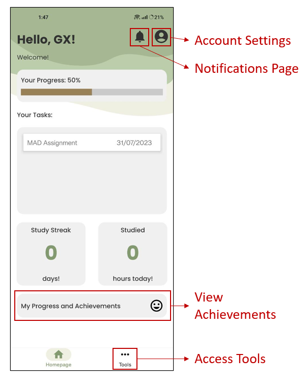

On the homepage dashboard you can view:
* Your progress percentage
* Your pending tasks
* Your study streaks
* Your number of hours studied
* On the homepage, there are also some buttons that lead you to various pages:
* Account Settings: View and manage your account information, logout, change profile picture
* Notifications Page: View all your notifications from EfficienZ
* Achievements Page: View all your achievements
* Tools Page: Access all the tools

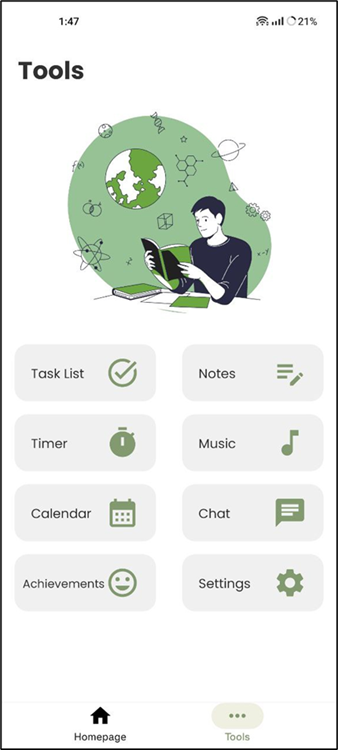

On the Tools page, you can access the following functions as displayed:
* Task Lists: View and manage your tasks
* Notes: Create, store, and organise text-based notes.
* Timer: Time tracking
* Music: Listen to music
* Calendar: View your tasks in a calendar
* Chat: Text messaging function
* Achievements: View all your achievements
* Settings: Manage app settings
* Homepage: Return to dashboard view

### Task Management

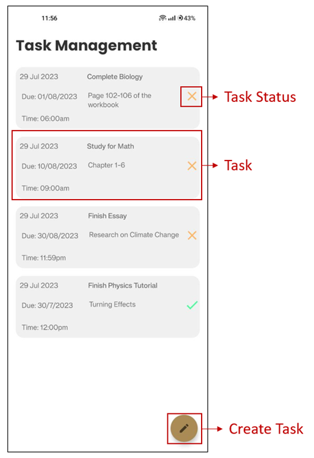

Here are some features of Task Management:

* Task: View your task details such as due date, time due, title, note, and status.
* Task Status: Tap on the icon to mark task as done or undone.
* Create Task: Create a new task. 

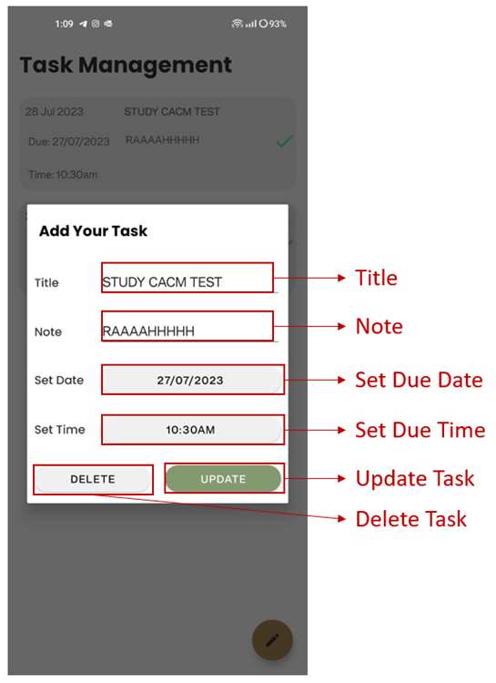

Upon creating/tapping on one of the task, here are the following functions:

* Title: Set title of the task
* Note: Add some notes to the task
* Set Due Date / Set Due Time
* Update Task: update the details of the task
* Delete Task: removes the task from the list 

### Note Taking

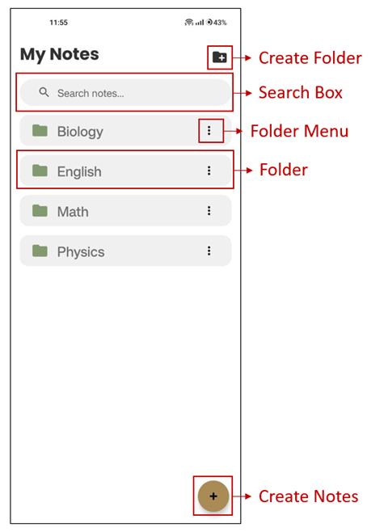

In Note-Taking, here are the following features:

* Create Folder: Creates a new folder to store your notes.
* Search Box: Search your notes or folder by its title.
* Folder: Organises your notes.
* Folder Menu: Edit your folder name or delete your folder.
* Create Notes: Create a new note 

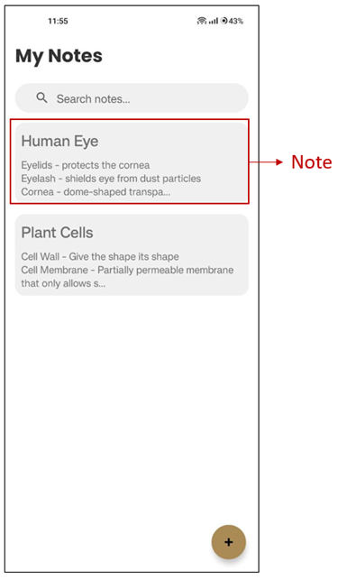

Upon clicking into one of the folders, you can create and view all your notes stored in that folder. 

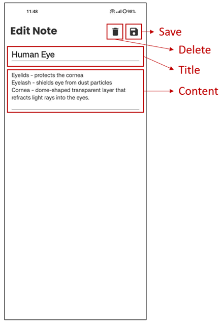

Upon clicking into one of the notes, you can edit the title and content. You can delete the note as well. Click the Save button to save your notes. 

### Time Management

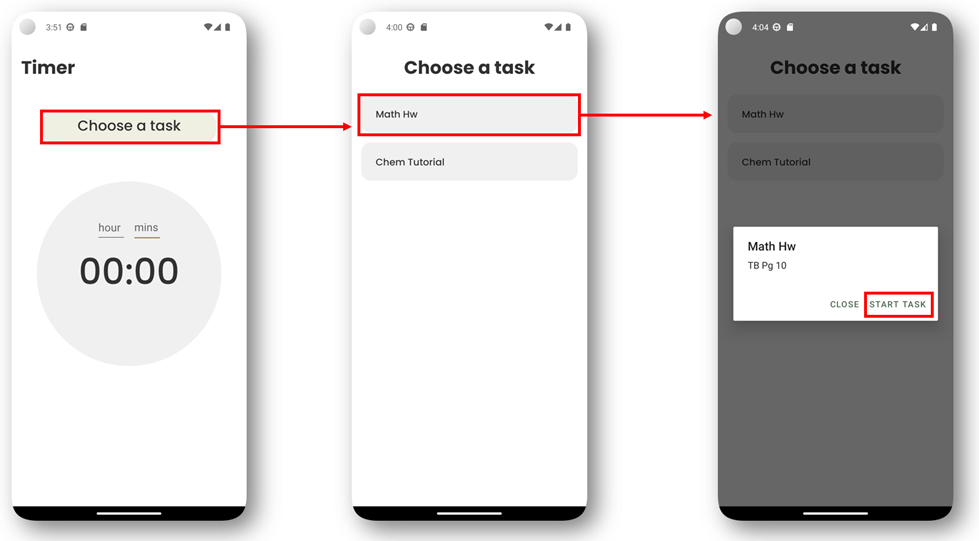

You can choose an uncompleted task to start working on after “clicking on choose a task” and then clicking on the task and then “Start task”. 

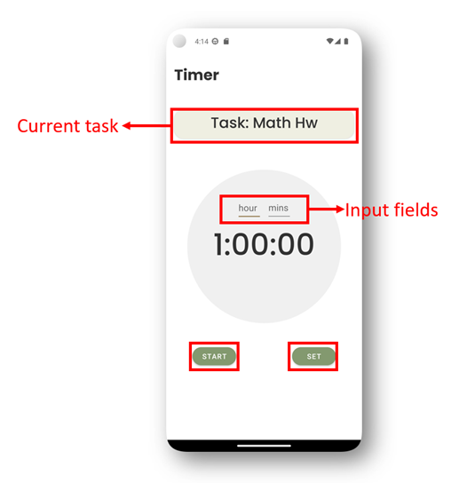

After selecting their tasks, you can type in their time under at the input fields and click on SET. The timer text will update, and you can click on start for the timer to start counting down. 

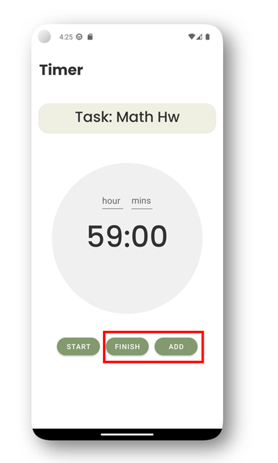

After pausing the timer, you have the choice to continue by clicking START, adding time to the current timer by clicking ADD, or if you are done with the task, click on FINISH to set the task as complete. 

### Music

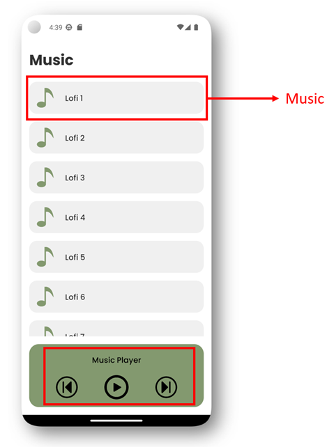

You can click on a music you would like to play, and it will automatically play. When the music finishes, it will automatically play the next music in queue. To stop, click on the pause button. To skip or rewind, click on the skip button on the right and the rewind button on the left respectively.  

### Calendar

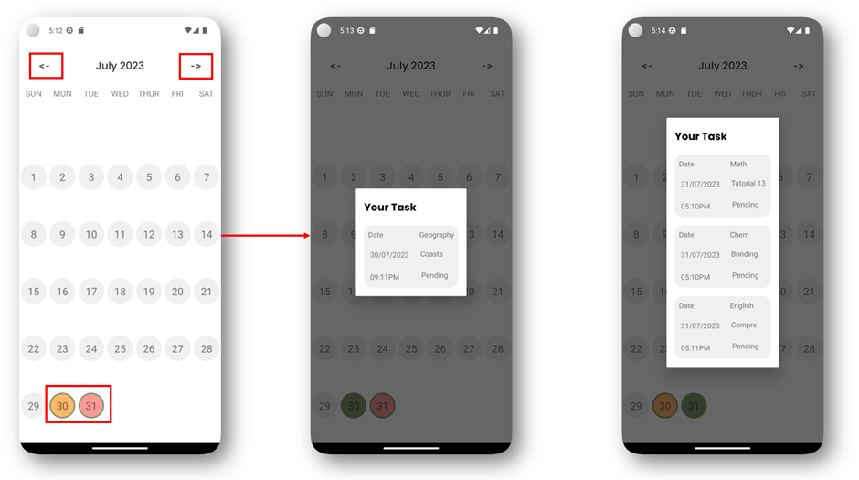

You can see which days your tasks are due on the calendar. If the there is 1 or 2 tasks due that day, it will be highlighted orange. If it is more than 3, it will be highlighted red. To view the tasks due the day, click on the day. To toggle between months, click on the arrows on top. 

### Chat

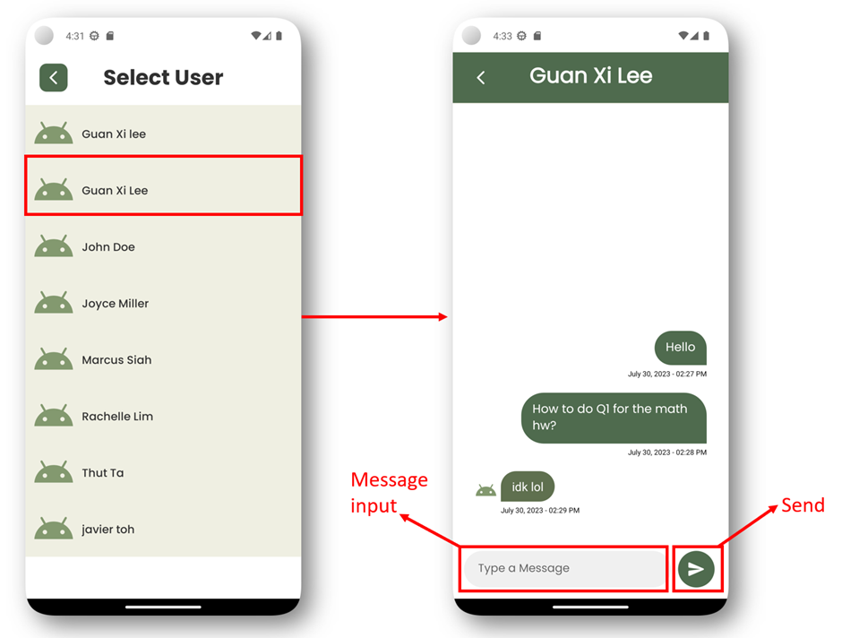

You can click on a user you would like to chat with which leads the chat history on the right. To send a message to the other user, simply type your message in the message input field and click send. 

### Achievement

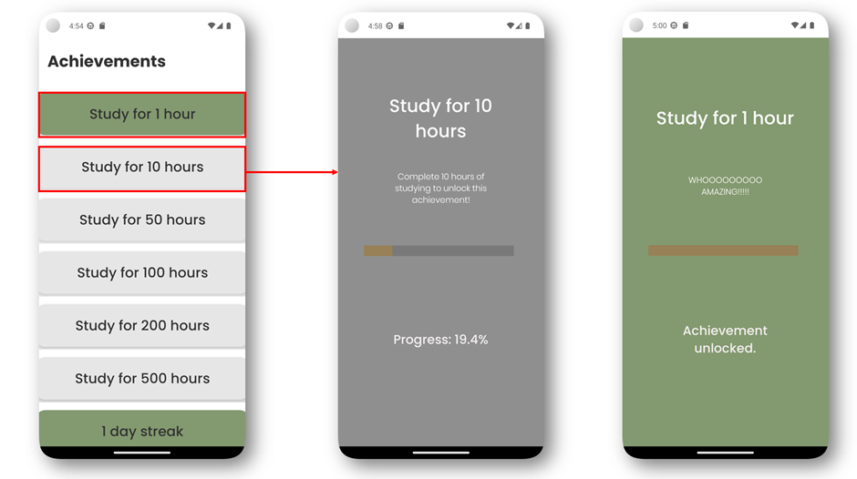

You can see the achievements you have accomplished by seeing which ones are green in colour. Clicking on an achievements you haven’t get will lead to a page letting you know of your progress(2nd pic). Clicking on a completed achievements will lead to the page on the right, celebrating your milestone  

### Settings

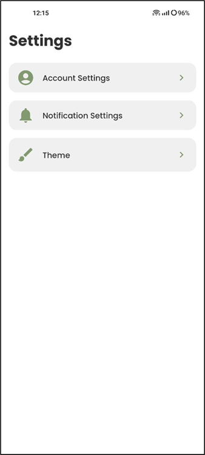

The Settings page has the following features:

* Account Settings: View and manage your account information, logout, change profile picture
* Notification Settings: Manage notification settings
* Theme: Light Mode, Dark Mode, Follow Device Settings 

### Account Settings

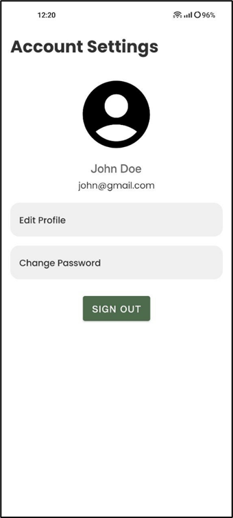

In Account Settings, here are the following features:

* Profile picture: Tap on the picture to set a new profile picture
* Edit Profile: Edit your name and email address
* Change Password: Change your account password 

### Notification Settings

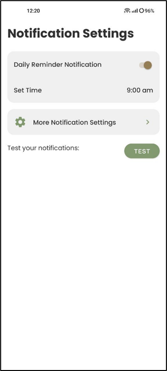

In Notification Settings, here are the following functions:

* Daily Notification Reminder: Sends daily reminder on the number of tasks pending at your specified time.
* Set Time: You can specify a time for EfficienZ to send you the Daily Reminder.
* More Notification Settings: Opens the device’s notification settings for more options.
* Test Notifications: You can use this button to check whether push notifications are working. 

### Notification Page

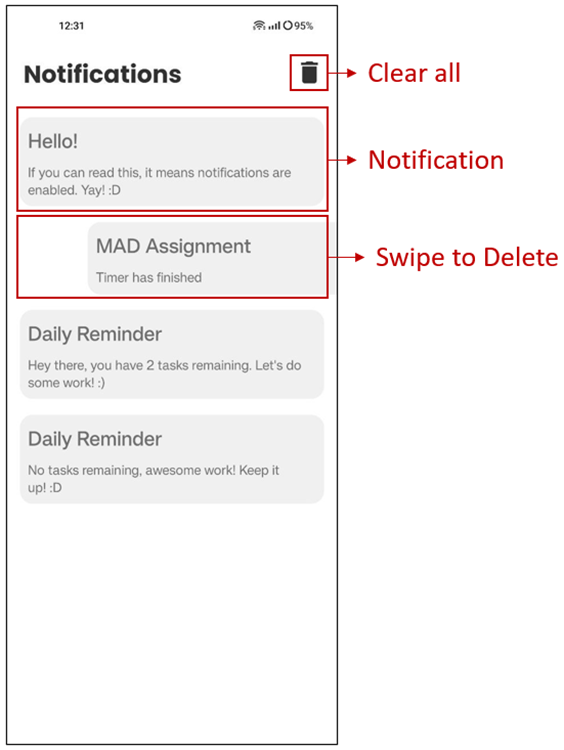

In the Notifications Page, here are the following features:

* Clear All Notifications: Deletes all the notifications.
* Notification: View the notification message.
* Swipe to Delete: You can individually delete each notification by swiping left or right. 

### Theme Settings

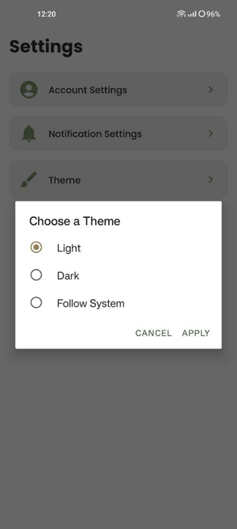

In Themes, you can pick the following themes:

* Light: Sets the app to Light Mode regardless of device’s theme mode.
* Dark: Sets the app to Dark Mode regardless of device’s theme mode.
* Follow System: Sets the app’s theme to whichever theme mode the device is using. 